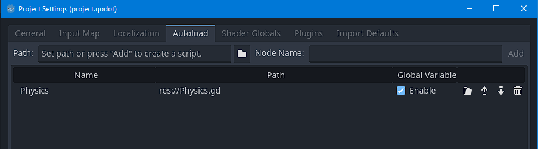

# Godot4Utils
Some Godot4 utilities and conversion functions from Unity

## Physics
Godot of Physics.OverlapBox found in Unity

`
Physics2D.OverlapBox(position:Vector2, size:Vector2, angle:float, layerMask: int, spaceBody)
`

Just add to the autoload and use it


Example:
```
extends RigidBody2D

func _ready():
  var position = Vector2(20,20)
  var size = Vector2.ONE / 2.0
  var rotation = 0.0
  var layer_mask = 1
  
  var overlapping = Physics.OverlapBox(position,size, rotation, layer_mask, self)
  
  print(overlapping)

```

Needs one more parameter, some reference to a rigidBody will do the trick
